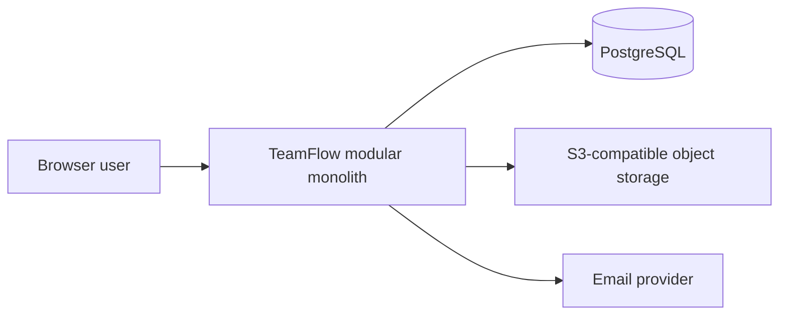
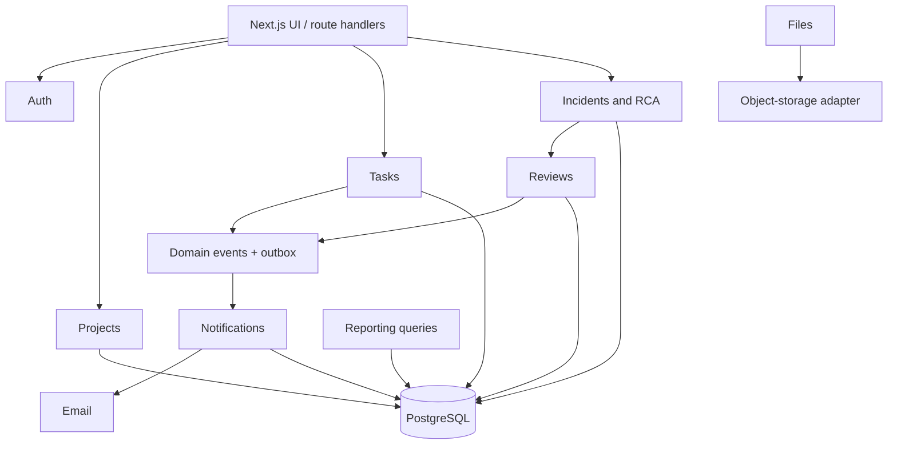
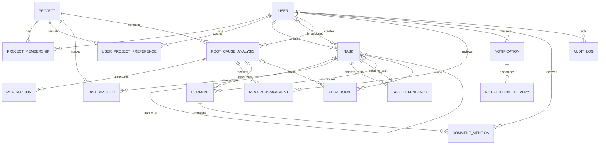
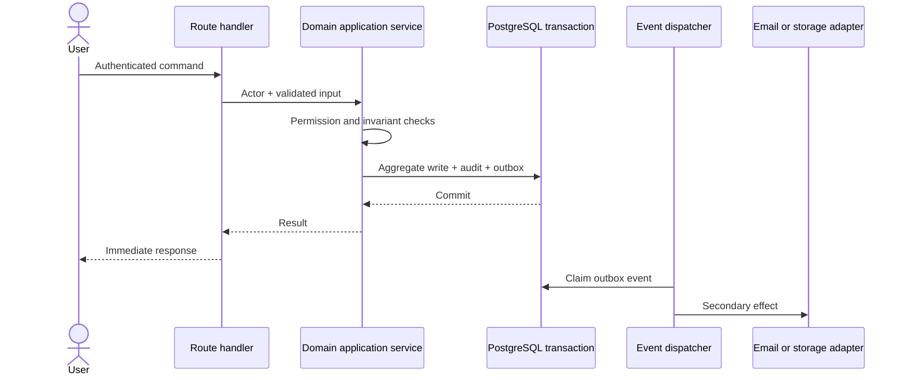

# Architecture and decisions

## System context

The Next.js application is one deployable unit. Modules own their rules and expose application services; route handlers adapt HTTP requests to those services. PostgreSQL is the source of truth. Files use object storage while PostgreSQL retains ownership and metadata.

## Module boundaries

## Domain model

`TaskProject` supports a task tracked in several projects. `TaskDependency` is a directed edge and rejects direct self-reference in PostgreSQL. Dependency conflicts remain saveable and are returned as warnings. Attachments and comments each enforce exactly one parent (task or RCA). Notification delivery is separated by channel while one event-level record owns deduplication.

## Service interaction

## Decision log

| Decision | Selected | Alternative | Tradeoff and rationale |
| --- | --- | --- | --- |
| Deployment | Modular monolith | Microservices | Faster delivery and cheaper operation; module boundaries preserve extraction paths. |
| Database | PostgreSQL | NoSQL | Transactions, joins, uniqueness, and foreign keys match memberships, dependencies, reviews, and audit. |
| Core communication | Synchronous | Fully asynchronous | Users receive immediate validation and authoritative outcomes. |
| Secondary effects | Domain events and outbox | Inline provider calls | More moving parts, but avoids coupling successful writes to email/storage availability. |
| Files | Object storage adapter | Database blobs/local disk | Requires a provider, but scales independently and keeps database backups focused. |
| Multi-project tasks | Explicit join entity | Duplicate tasks | One task identity avoids divergent copies and supports indexed project queries. |
| Authorization | Server-enforced roles plus assignment authority | UI-only checks | Every mutation remains safe regardless of client behavior. |
| Dependency conflict | Non-blocking warning | Reject save/transition | Preserves planning flexibility while making risk visible, matching the recovered product decision. |
| RCA closure | Unanimous assigned approval | Majority/first approval | Slower completion, but every reviewer is accountable and rejection cannot be bypassed. |
| Notification failure | Surface email failure, no silent retry | Automatic retries | Clear v1 behavior and lower operational complexity; failed delivery remains recorded. |

## Future scenarios (not implemented)

- **Offline-first:** append client commands to a local queue, use versioned aggregates and conflict responses, and synchronize through idempotency keys.
- **Compliance:** single-tenant deployment options, immutable audit export, customer-managed keys, retention policies, and evidence-producing access reviews.
- **High scale:** read replicas, partitioned audit/outbox tables, cached reporting projections, queued event delivery, and selective module extraction.
- **Multi-region:** a home region per project or tenant, globally replicated reads, region-aware object storage, and explicit conflict ownership.
- **Extreme low cost:** one small application instance, managed/serverless PostgreSQL, provider free tiers, and an in-process outbox dispatcher.
